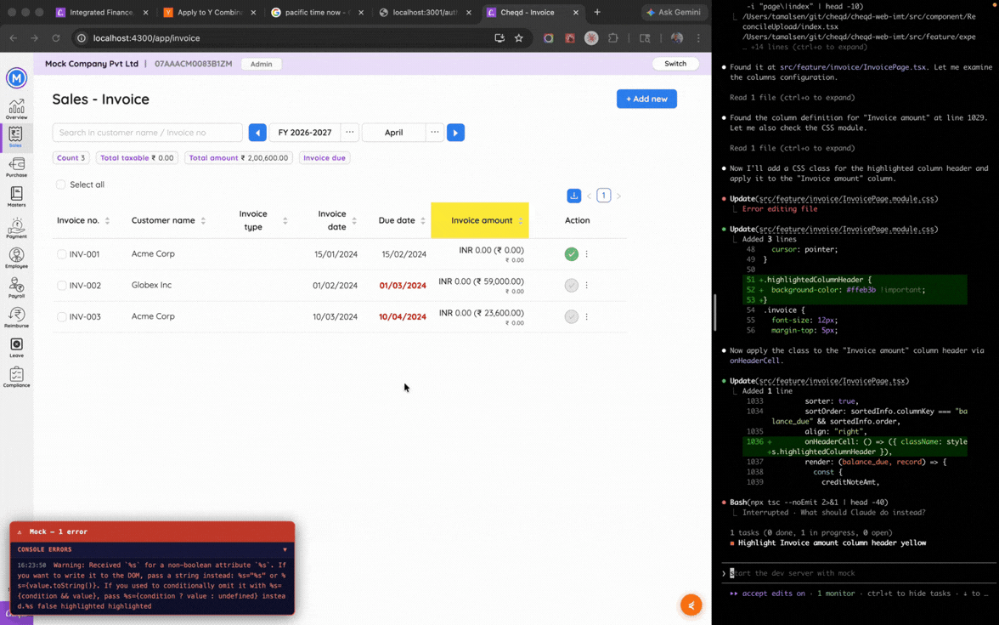
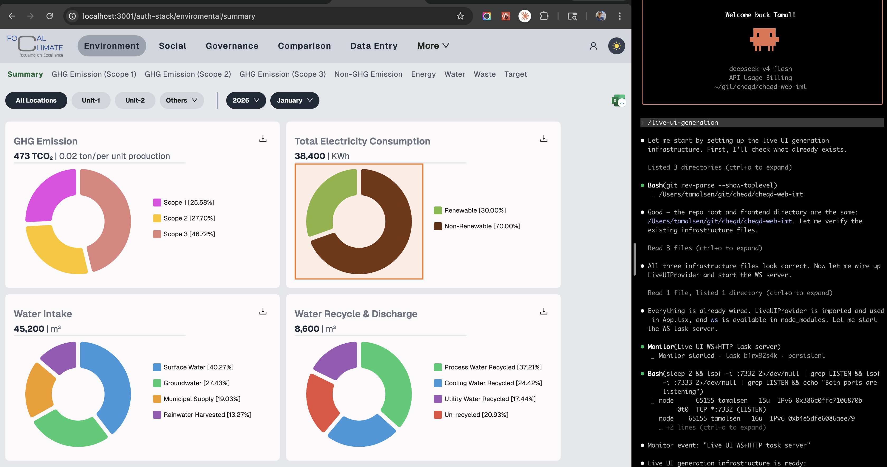
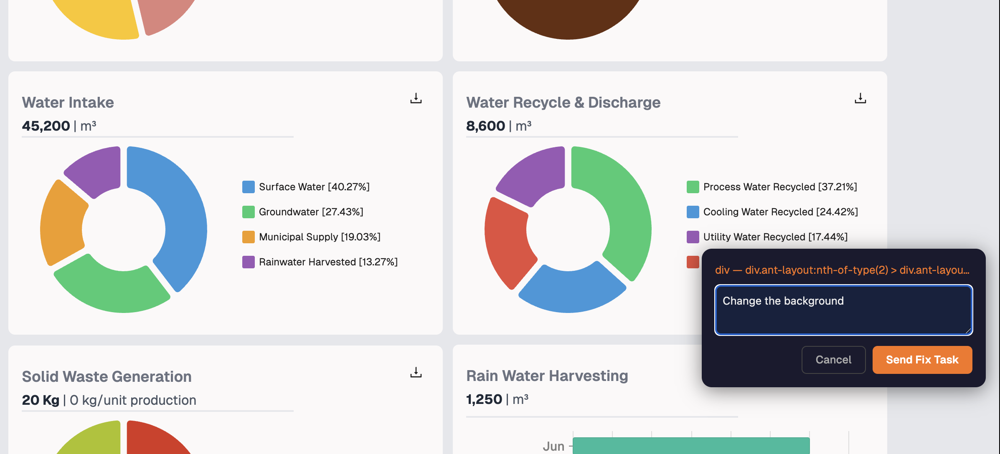

<div align="center">
  
</div>

---
<div align="center">
<div style="font-size: 24px;">Command your <span style="color: #ff6b35;">coding agents</span> from browser</div>
<br/> 
Frontloop is available as a plugin for Claude Code and can be extended to other agents and platforms. The first skill, <span style="color: #ff6b35;">live-ui-generation</span>, instruments any (read <a href="#agent-support-beyond-claude-code">supported frameworks</a>) frontend frameworks and enables real-time UI changes by clicking on elements and describing the desired change — no more context-switching to an IDE or writing CSS overrides.
</div>
<br/> 

---



## Why
- **Efficient**: The current workflow for making UI changes with coding agents is disjointed and inefficient. You have to switch between your running app (browser), the coding agent and your IDE. You have to describe the element, its styles, and its context in text prompts, which is less precise and more time-consuming than direct interaction. Frontloop fixes that.
- **Time & Token saving**: When you say "remove the due date column on invoice page", Less context for the agent leads to more back-and-forth using `grep` and slower iterations. With full DOM context, coding agents can make precise edits in one step, saving tokens and time.
- **Intuitive**: Faster iterations with real-time feedback enable a more intuitive and efficient workflow. You can see the impact of your changes immediately, make adjustments on the fly, and achieve the desired result in fewer steps.

## Install

### Claude Code
```
/plugin marketplace add tamal-thetaonelab/frontloop
/plugin install frontloop
```

---

## Skills

### `/live-ui-generation`

Click any element on your running app. Describe the change. Claude Code receives the full DOM context — selector, outer HTML, computed styles, container context, and page URL — edits the source file directly, and hot reload delivers the result.

An orange shimmer appears over the selected element while Claude works and clears on completion.




What Claude receives per task:

```json
{
  "id": "a3f9bc12",
  "type": "dom-fix",
  "prompt": "make this card background light grey and increase padding to 24px",
  "element": {
    "selector": "#employee-card > div.header",
    "tag": "div",
    "html": "<div class=\"header\">...</div>",
    "text": "Employee Card",
    "styles": { "background": "rgb(255,255,255)", "padding": "16px" },
    "componentHierarchy": "EmployeeCard (EmployeeList > AppRoot)"
  },
  "container": { "title": "Employee Card", "dataKeys": ["Name", "Role"] },
  "pageTitle": "Employees — MyApp",
  "page": "http://localhost:4300/app/employee"
}
```

Not a CSS override. A real source edit with full codebase context.

**How it works:**

- A floating button (FAB) appears in your browser in dev mode
- On-hover it reveals two input mode - Dom element selector and screenshot selector
- In Dom element selector mode, select an element, type your fix — a loader appears
- In screenshot selector mode, draw a box around the area you want to change, describe the change — a loader appears
- A WebSocket server streams the task payload to Claude as a real-time notification
- Claude edits the source file, runs a type check, then sends a completion signal
- Loader clears, HMR delivers the change. If HMR can potentially not work, a reload signal is sent instead.

**Framework support:** 
- ✅ React
- ✅ Next.js
- ✅ Angular
- 🚧 Vue 3 / Nuxt
- 🚧 Svelte / SvelteKit
---

## Update

### Claude Code
```
/plugin marketplace update frontloop
```
( set auto-update to true for automatic updates )


---

## Requirements

- Claude Code
- Node.js 18 or higher
- Dev server running before invoking the skill (for WebSocket connection and DOM context)

---

## Roadmap

### 🚧 Undo support *(in development)*
Implementing undo functionality for UI changes made through the `live-ui-generation` skill. This will allow users to easily revert changes if the result is not as expected, providing a safety net and encouraging experimentation.

### 🚧 `mock-setup` *(in development)*
A complete mock backend layer using Mock Service Worker. The agent reads your existing API calls, generates stateful MSW handlers, wires up working auth without touching production code, and verifies every route renders correctly.

Run your frontend entirely offline. Demo without a real backend. Build features before the API exists.

---

### 🚧 Agent support beyond Claude Code

`live-ui-generation` works with Claude Code today. The WebSocket server and DOM inspector are agent-agnostic — any coding agent that can read from a WebSocket endpoint can consume the task payload.

Planned: Cursor, GitHub Copilot Workspace, Gemini CLI, Windsurf.

---

### 🚧 UI platform support

Planned additions: Vue 3 / Nuxt, Svelte / SvelteKit, React Native web (Expo).

---

## What this is not

- Not active in production — dev mode only
- Not a cloud service — everything runs on localhost
- Not a no-code tool — Claude writes real source code against your real codebase
- Not a CSS inspector — changes persist in source files, not browser overrides

---

## Contributing

New plugins and skills welcome. Fixing bugs, improving docs, and expanding agent or framework support are all great ways to contribute.

---

## License

MIT

---
Built with ❤️ by [Tamal Sen](https://github.com/tamal-thetaonelab) - A bengali coder turned entrepreneur.
